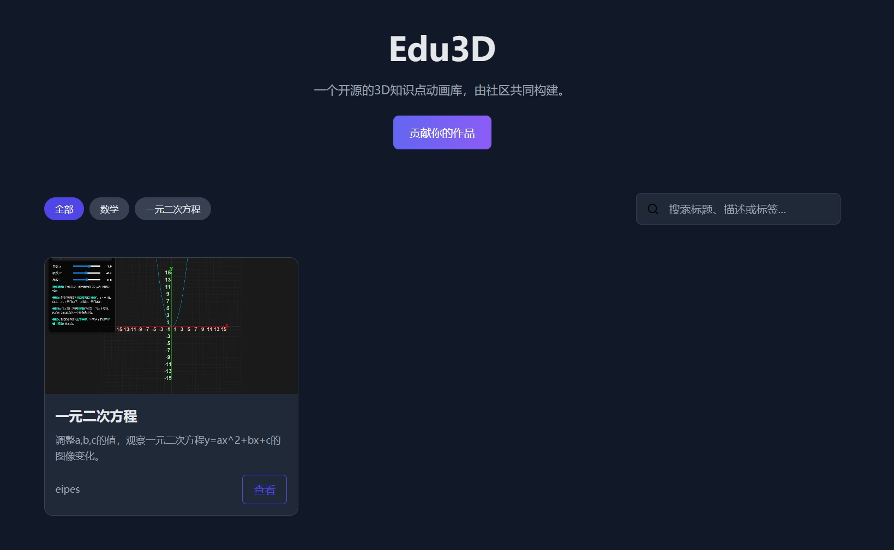

# Edu3D

[](https://github.com/eipes/edu3d/stargazers)
[](https://github.com/eipes/edu3d/fork)
[](LICENSE)

一个开源的 3D 知识点动画库，旨在通过交互式网页动画，让中小学知识（如数学、物理、生物等）变得生动、直观、易于理解。

[**➡️ 访问线上站点**](https://eipes.github.io/edu3d/)  <!-- 替换成你的 Vercel 或 GitHub Pages 链接 -->


<!-- 建议你截一张最终页面的图片，放在这个位置，并命名为 project-screenshot.png -->

---

## ✨ 项目理念

我们相信，复杂抽象的知识点（如立体几何、行星运动、分子结构）可以通过 3D 可视化变得简单。本项目旨在创建一个由全球开发者社区共同构建和维护的知识动画库，为学生、教师和所有热爱学习的人提供免费、高质量的学习资源。

*   **开源协作**：任何人都可以贡献自己的 3D 动画作品。
*   **简单易用**：无需注册，通过简单的 GitHub Pull Request 即可完成贡献。
*   **技术开放**：你可以使用任何你喜欢的 Web 3D 技术（Three.js, Babylon.js, WebGL 等）来创作。
*   **完全免费**：所有内容和代码均在 MIT 许可下开源。

## 🚀 如何贡献你的作品

贡献一个 3D 动画非常简单！你只需要创建一个 HTML 文件和一些描述信息。

### 步骤 1: Fork 本仓库

点击本页面右上角的 **Fork** 按钮，将此项目复制到你自己的 GitHub 账户下。

### 步骤 2: 克隆你的 Fork

将你 Fork 的仓库克隆到本地：

```bash
git clone https://github.com/eipes/edu3d.git
cd edu3d
```

### 步骤 3: 创建你的贡献内容

1. 在 contributions 目录下，为你的作品创建一个新的文件夹。文件夹名称应使用简短的英文或拼音，例如 pythagorean-theorem 或 ziyouluoti。

```
contributions/
└── pythagorean-theorem/  <-- 这是你的新文件夹
```

2. 在你的文件夹中，创建以下两个必须的文件：

* index.html: 这是你的 3D 动画网页。它可以是完全独立的，所有 CSS 和 JS 最好内联或放在同一文件夹下，以确保其可移植性。

* manifest.json: 描述你的作品的元数据。

3. manifest.json 文件格式如下，请务必填写完整：

```
{
  "title": "勾股定理的可视化证明",
  "description": "通过一个 3D 动画演示切割和重组正方形面积来证明 a² + b² = c²。",
  "author_github": "your-github-username",
  "tags": ["数学", "几何", "初中", "勾股定理"],
  "subject": "数学",
  "grade_level": ["初中"]
}
```

* title: 作品的标题。

* description: 对作品的简短描述。

* author_github: 你的 GitHub 用户名，用于展示作者信息。

* tags: 相关的关键词标签，便于搜索。

* subject: 所属学科 (如: 数学, 物理, 化学, 生物)。

* grade_level: 适用年级 (如: 小学, 初中, 高中)。


### 步骤 4: 提交 Pull Request

将你的改动提交，并向上游（原始仓库）发起一个 Pull Request。

```
git add .
git commit -m "feat: add pythagorean theorem demo"
git push origin main
```

然后回到你的 GitHub 页面，点击 "Contribute" -> "Open pull request"。

我们会审核你的提交。一旦合并，你的作品就会通过自动化流程被构建、生成缩略图，并最终展示在我们的网站上！
